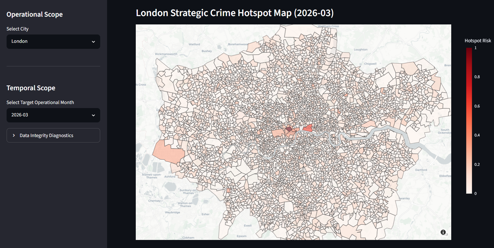
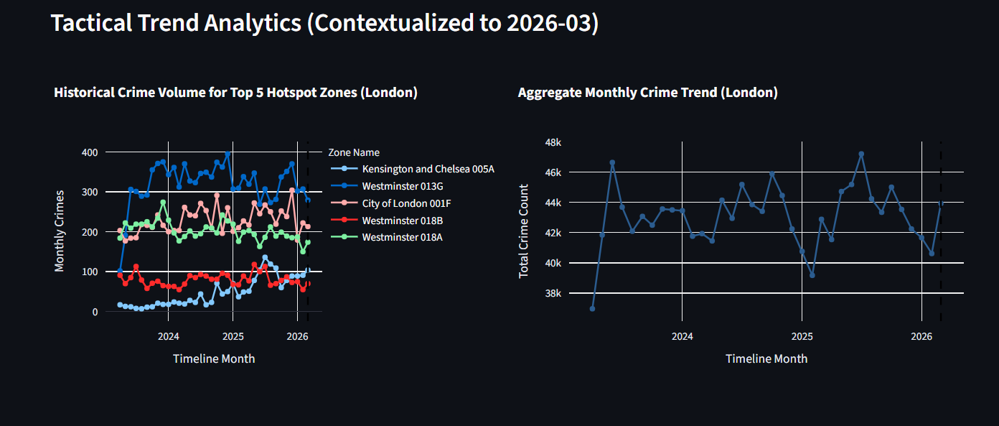
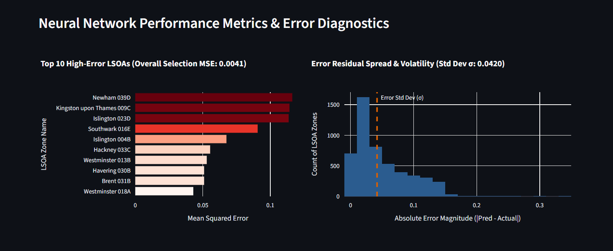
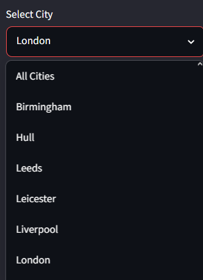
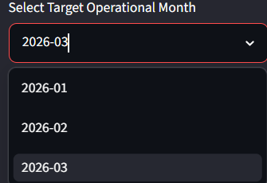

# CBL 4CBLW020 Addressing real-world crime and security problems with data science
## Description
This is the GitHub page dedicated to CBL 4CBLW020 Addressing real-world crime and security problems with data science at Eindhoven University of Technology, Netherlands  for group 17.
The front page is split in 2 parts:
 - Instructions of how to reproduce the used neural network and dashboard
 - Results from the neural network and dashboard
## Technical guide
1. The first step to reproduce the project is cloning the repository 
   
```
git clone https://github.com/TwentySubsTBP/CBL_17_London
```

2. To run the neural network navigate to

```
path/to/project /CBL_17_London/main/Network
```

3. And run

```
Cyberdyne Systems Model T-800.py
```

4. And for the Dashboard you should run:

```
python -m streamlit run main/Dashboard/dashboard.py
```
## Results showcase
The project trained a neural network using street level crime data from 10 cities in the United Kingdom from April 2023 until April 2026, with the data provided by [police.data.uk .](https://data.police.uk/data/) We used stop-and-search reports, as a method to validate our predictions. Clear report on the how and why of the process can be found here (link to the report ). The next section is split in two showcasing the neural network used, and the Dashboard that was used to showcase its result.
### The Neural network

1. Show something from the neural network.
2. Show another result from the neural network.

### The Dashboard

**Figure 1. Showcasing the look of the dashboard with a heatmap and city/month selector**

**Figure 2. Showcasing the graphs that accompany the heatmap to provide more context**

**Figure 3. Neural network performance**

**Figure 4. the selectors which provide a choice of combinations between months and cities**


## Resources
For now I will just put what’s in the report as well as the police since I'm out of ideas also that one GitHub repo which gave me inspiration of how to make this GitHub page
### Data Sources

- UK Police Open Data: [https://data.police.uk/data/](https://data.police.uk/data/)
    

### Project Inspiration

- Crime Dashboard by Geobuddy: [https://github.com/Geobuddy/Crime-Dashboard](https://github.com/Geobuddy/Crime-Dashboard)
    
    - This repository served as inspiration for the structure and presentation of our GitHub page.
        

### References

1. Ashby, M. P. J. (2020). _Initial evidence on the relationship between the coronavirus pandemic and crime in the United States_. Crime Science, 9(1), 6.
    
2. Diggle, P. J., Menezes, R., & Su, T.-L. (2010). _Geostatistical inference under preferential sampling_. Journal of the Royal Statistical Society: Series C (Applied Statistics), 59(2), 191–232.
    
3. Ensign, D., Friedler, S. A., Neville, S., Scheidegger, C., & Venkatasubramanian, S. (2018). _Runaway feedback loops in predictive policing_. Proceedings of the 1st Conference on Fairness, Accountability and Transparency, 160–171.
    
4. European Union Agency for Fundamental Rights. (2024). _Addressing racism in policing_.
    
5. Koper, C. S. (1995). _Just enough police presence: Reducing crime and disorderly behavior by optimizing patrol time in crime hot spots_. Justice Quarterly, 12(4), 649–672.
    
6. Langton, S., Dixon, A., & Farrell, G. (2019). _Small area variation in crime effects of COVID-19 policies in England and Wales_. Journal of Criminal Justice, 75, 101830.
    
7. Lum, K. (2016). _Predictive policing reinforces police bias_. Human Rights Data Analysis Group (HRDAG). Available at: [https://hrdag.org/2016/10/10/predictive-policing-reinforces-police-bias/](https://hrdag.org/2016/10/10/predictive-policing-reinforces-police-bias/) (accessed June 2, 2026).
    
8. Perry, W. L., McInnis, B., Price, C. C., Smith, S., & Hollywood, J. S. (2013). _Predictive Policing: The Role of Crime Forecasting in Law Enforcement Operations_. RAND Corporation.
    
9. Seyidoglu, H., Farrell, G., Dixon, A., Pina-Sánchez, J., & Malleson, N. (2024). _Post-pandemic crime trends in England and Wales_. Crime Science, 13(1), 6.
    
10. Tompson, L., Johnson, S. D., Ashby, M. P. J., Perkins, C., & Edwards, P. (2015). _UK open source crime data: Accuracy and possibilities for research_. Cartography and Geographic Information Science, 42(2), 97–111.
